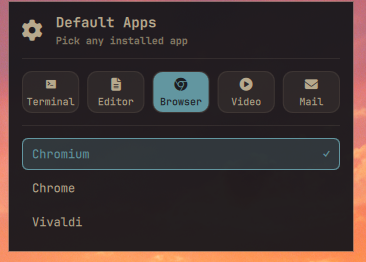

# setup.defaults

A plugin for [Omarchy](https://omarchy.org/) that lets you set the system
default **terminal, editor, browser, video player, and mail client** — and
crucially, it is not limited to the handful of apps Omarchy ships defaults
for. It detects *whatever is actually installed* on your machine (by scanning
`.desktop` files and `PATH`), so you can pick Vivaldi, gedit, VLC, or anything
else directly from the bar. Browsers are discovered dynamically: every
installed `.desktop` file registering an http/https handler or `text/html`
shows up automatically, including Flatpak apps and niche browsers.



## What it does

Click the cog icon (󰛇) in the Omarchy bar to open a popup. Pick a category,
then pick an app from the list of installed candidates. The choice is applied
immediately and a notification confirms it. The current default is marked with
a check.

| Category | How the default is applied                              |
|----------|---------------------------------------------------------|
| Terminal | `~/.config/xdg-terminals.list` (xdg-terminal-exec)      |
| Editor   | `~/.local/state/omarchy/defaults/editor` (used by `omarchy-launch-editor`) |
| Browser  | `xdg-settings set default-web-browser`                  |
| Video    | `xdg-mime default` across video mime types              |
| Mail     | `mailto` scheme handler + `x-scheme-handler/mailto`     |

Because it uses the same mechanisms Omarchy itself uses, the defaults are
honored by `omarchy launch browser`, `omarchy launch editor`, the file
manager's "open with", and the rest of the desktop.

## Installation

```bash
omarchy plugin add https://github.com/nightdevil00/setup.defaults.git --enable
```

That clones the plugin into `~/.config/omarchy/plugins/setup.defaults` and
enables it (adding the cog icon to your bar) in one step.

To open it, click the cog icon in the bar, or run:

```bash
omarchy-shell shell toggle setup.defaults
```

The shell discovers the plugin automatically; no restart is required, but if
the icon does not appear run `omarchy restart shell`.

## Removal

```bash
omarchy plugin remove setup.defaults --yes
```

This disables the plugin and removes it from
`~/.config/omarchy/plugins/setup.defaults`. Your configured defaults
(terminal/editor/browser/video/mail) are left untouched.

## License

[MIT](LICENSE) — see [LICENSE](LICENSE) for the full text.

## Usage

1. Click the cog icon in the center of the bar (next to Spotify by default).
2. Choose a category: **Terminal · Editor · Browser · Video · Mail**.
3. Click an installed app. It becomes the default and a notification appears.

## Command line

The same logic is available as a script (`set-defaults.sh`, also symlinked as
`omarchy-defaults` when on your `PATH`):

```bash
omarchy-defaults categories                 # terminal editor browser video email
omarchy-defaults list browser               # installed browsers (id<TAB>name)
omarchy-defaults get editor                 # current default
omarchy-defaults set video vlc.desktop      # apply VLC as the video player
```

App ids are desktop-file ids for terminal/browser/video/mail and binary names
for editor (matching how `omarchy-launch-editor` resolves them).

## Files

- `manifest.json` — plugin metadata
- `BarWidget.qml` — bar icon that toggles the panel
- `Panel.qml` — category / app selection popup
- `set-defaults.sh` — detection + apply backend
- `preview.png` — screenshot
